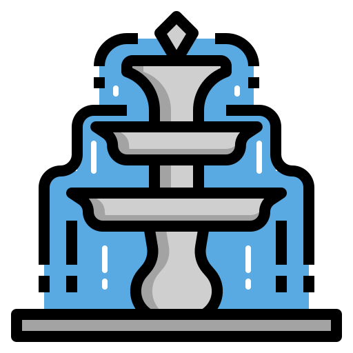
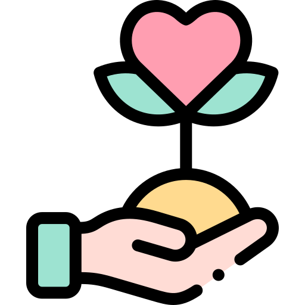

<h1 align="center">
  
  
<strong align="center"> Praticando Web Scrap </strong>

</h1>

 

<h2> Descrição </h2>

 

 Alguns códigos onde pratico essa maravilhosa arte de raspagem de dados. 

 

<h2> Site fonte </h2>

<ul>
  <li></li>
  <li></li>
  <li></li>
  <li></li>
</ul>

 

<h2> Autor </h2>

<table>
  <tr>
    <td align="center"><a href="https://www.linkedin.com/in/vini-antunes/"> <b>Vini Antunes</b></a> </td>
  <tr>
</table>

 

<h2> Agradecimentos </h2>
<ul>
  <li>
Icons made by <a href="" title="iconixar" target="_blank">iconixar</a> from <a href="https://www.flaticon.com/" title="Flaticon" target="_blank">www.flaticon.com</a>
</li>
</ul>
